# Qlourie Astral R
My personal BeamNG mod project with some simple Lua codes.

NOTE: THIS README IS OUTDATED AND NEEDS A REWORK. ITS OUTDATED BY AT LEAST 8 MONTH.

It comes from Automation, I made the car in Automation and rewrote almost everything's Jbeam by myself so the physics are completely new. The project started at about 2022/7, and this Github repo is created at 2024/1/16.

[2022/07/24](https://www.bilibili.com/video/BV17S4y1E7BH/)
[2022/08/23](https://www.bilibili.com/video/BV1ea41157pe/)

# What Is It
This mod is inspired by the World Rally Championship (WRC). While the vanilla game features the Vivace, it doesn’t fully adhere to the actual WRC regulations concerning aspects such as weight and the center differential, suspension design and WRC aero bodykits. My goal is to craft a WRC car that complies with the 2017-2021 WRC regulations and to simulate the physics with as realistic as possible. This car will participate BRC, BeamNG Rally Championship. At the very least, the suspension system will offer a more authentic feel compared to rally cars in the game.

Also, there are Rally2 variant and WorldRX RX1 variant, since they share some similarities.

# How to Use This Repo
## What's in this repo?
This repo contains engine sound files, all Jbeam files, and Lua files.

At the time of 2024/3/21: 

LRS detection is done

Active Center Differential is done

Launch control is BeamNG's vanilla but changed brake trigger to handbrake

## How to update?
I'm not very familiar with Github, but I know Github can't store empty folders, so maybe it's not the best idea to upload everything because there are lot's of empty folders. The reason I'm using Github is tracking of Jbeam edits and Lua writing. 

However you can download releases for pre-release test, and eventually I will upload to BeamNG's mod repo for free. 

Alternatively, you can update yourself if there's something you want to, manually download files and the folder structure should look like this:

**Configs: BeamNG Userdata\version\mods\unpacked\un1corn_qlourie_astral_r\vehicles\qlourie_astral_r\files**

**Jbeam: BeamNG Userdata\version\mods\unpacked\un1corn_qlourie_astral_r\vehicles\qlourie_astral_r\body and engine\files**

**Lua: BeamNG Userdata\version\mods\unpacked\un1corn_qlourie_astral_r\vehicles\qlourie_astral_r\Lua\files**

**Engine Sound: BeamNG Userdata\version\mods\unpacked\un1corn_qlourie_astral_r\art\sound\blends and engine and shift\files**

# Things to Remind
I have a job and it's quite busy, so I can't take my time fully on this project. As experimenting and testing Jbeam properties are quite heavy work, there are some imperfections. Also, I've found it's not worth to dig deeper with Automation model as there are tons of hassle with opacity map and mesh overlap, this mod will be at where it is. I'm not planning to make the model more detailed or get whole Jbeam design revamped.

However I'm really looking forward to build a new car from the ground up. I'm learning sketching and I plan to make a new car in Blender, at that time it will have it's road counterpart also Rally4, Rally2 variant.

Also some fictional lore friendly brands and sponsors! There is actually now in the mod by Automation modders but I'm planning to make my own original sponsors.

# Features
## Chassis
- Modified chassis for better stability and rigidity, also moved suspension mounting points
- Separated parts from Automation model for better deformation and animation
## Engine and Transmission
- Realistic engine curve referenced from telemetry of other games
- Different Turbo restrictor and ECU setting for different variant
- Active center differential for BRC variant which respond to throttle, brake, steering inputs and wheel speed
## Suspension
- Extra long suspension arms for better FVSA length, optimized FVSA for less camber gain
- Calculated suspension geometry for optimal bump steer and toe steer performance
- Springs are selected as parts instead of tuning
- Individually tested spring length for different stiffness
- Spring perch preload adjustment
- Anti-roll bar mounting point adjustable with 3 fixed stiffness ARBs
- 540 degree steering wheel lock
- Rack and pinion steering, 7.5:1/8.2:1/9.1:1 selectable steering ratio
## Dampers
- Dampers developed with **CTM Racing Suspension**
- Around 800mm gravel damper length, 600mm tarmac damper length, full damper length not adjustable for consistent droop travel
- Inverted strut design, 46mm piston diameter, 18mm shaft diameter
- Pressurized mono-tube dampers that naturally have a force to push the piston out when no load is applied
- Bump velocity threshold (knee point) is moved in response to changes in bump settings, providing a more accurate representation of real-world damper tuning
- LRS (Load Release System): Release rebound damping when wheel load below a set threshold is detected, allowing faster wheel contact and all power to the ground. The damping curve is returned to normal is wheel load is above threshold
- DSV (Direction Sensing Valve): Detect the direction of force to the damper, when the force is from the ground, the damper will remain unchanged for consistency; when the force is from above, the valve will close and add additional damping to brace impact
- HBS (Hydraulic Bump Stop): Additional damping valve that will active at around from the last 15% of damper travel, the valve is closed to generate a siginificant amount of damping force. Rubber stop is still installed on HBS model for protection
- HRS (Hydraulic Rebound Stop): A large amount of damping force would generate when the damper is near full droop to stop the damper from extending. Rubber stop is still installed on HRS model for protection
- Independently modelled suspension mesh that is totally accurate of a real damper and spring movement, including piston, shell, spring, helper spring and spring perch
## Wheels
- 20KG per tarmac wheel and 25kg per gravel wheel
- Node weight calculated based on the rim weight limit (8.6kg and 8.9kg) as specified by WRC regulations
- 205/65 R15 gravel wheels, 235/40 R18 tarmac wheels
- Special wheels including RX, Winter and Arctic
- Wheel beam properties are created and tested which are different to vanilla
## Aerodynamics
- Front and rear independent aerodynamics
- Aerodynamics react to ground clearance change both front and rear
- Originally designed effective aero parts from bumper, lip, chassis, fender and more 
- Significant grip loss when aero parts are broken
## Misc
- Ballast for center of gravity adjustment (needed to meet minimum running weight regulations)
- Driver weight included in racing seat part for real world weight simulation
- Up to 2 Spare wheel selection for weight accuracy

# Configurations&Specifications
## BRC (Formerly WRC+ and now Rally1)
*The pinnacle rallying class which now anticipating BRC.*
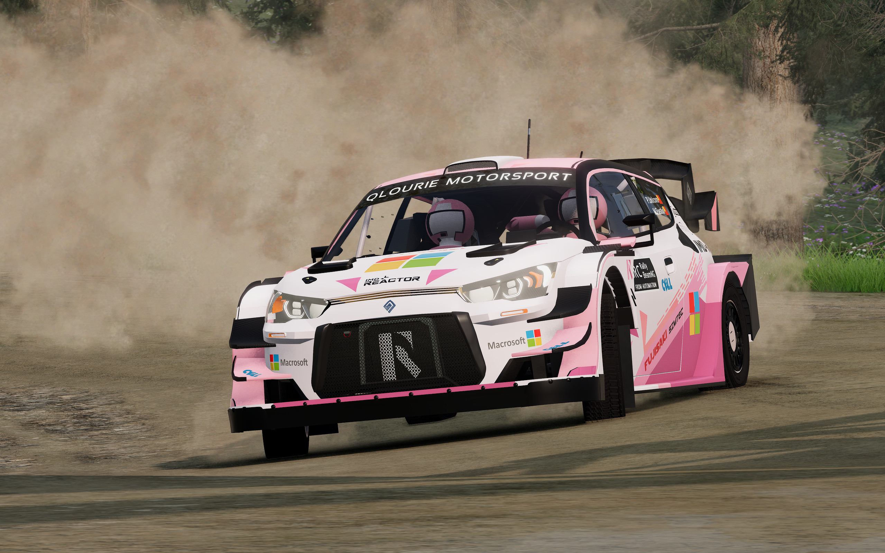
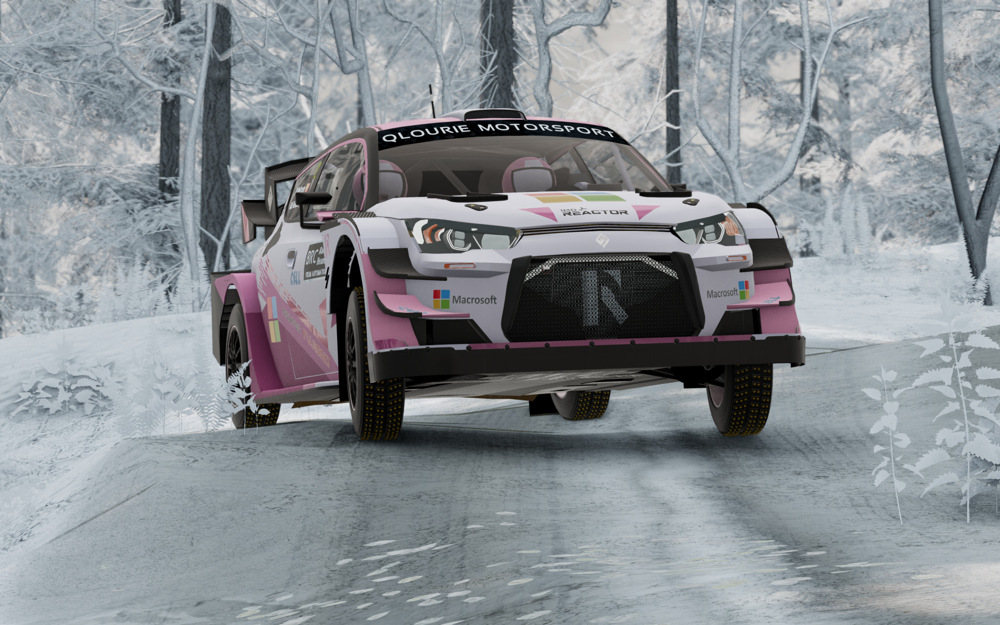
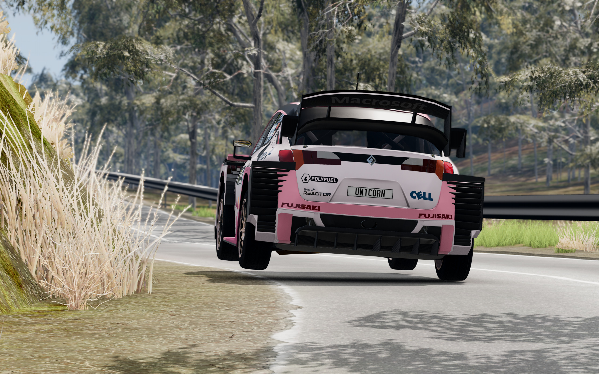
### Dimensions and Weight
- Size: 4099mm/1875mm/Height Adjustble
- Wheelbase: 2547mm/Adjustable
- Weight: 1190kg with one spare/1360kg with crew and one spare/1390kg running weight/~50:50 weight distribution
### Engine and Transmission
- Engine: H4DPA 1.6L inline 4/BRC ECU and modification
- Intake: 2.5 bar anti-lag turbocharger/36mm turbo restrictor
- Power: 380hp@6000RPM/450Nm@5500RPM
- Transmission: 6-speed sequential transmission/Paddle shifter
- Top Speed: 200 km/h (ratio specific)
- Differential: Front and rear LSD/Active center differential 43:57 and 36:64, with hydraulic handbrake disengage mechanism
### Suspension
- Spring rates:

  Gravel: 17.5 to 30.0N/mm front, 15.0 to 27.5N/mm rear, incremental difference of 2.5N/mm
  
  Tarmac: 38.0 to 63.0N/mm front, 33.0 to 58.0N/mm rear, incremental difference of 5.0N/mm
  
  Helper: 3.5N/mm
- Damper Model: CTM Racing MSR85/MSR65 3+1Way
- Damper Travel: 325mm on MSR85/240mm on MSR65
- MSR85: LRS, DSV, HBS, HRS, LRS open factor adjustable, HBS damping adjustable
- MSR65: LRS, DSV, HBS, HRS, LRS open factor adjustable, HBS damping adjustable
- Shim Stacks: #1 Progressive/#2 #2 Linear biased to progressive(gravel), digressive(tarmac)/#3 Digressive
- Adjustment Way: HS (High Speed) and LS (Low Speed) bump, rebound
- Adjustment Range: 64 levels of LS bump, 64 levels of rebound, 32 levels of HS bump and 16 levels of HBS
- Brake: 300mm gravel(selectable ducted brake)/370mm tarmac(selectable ducted brake)
### Config Specific Aerodynamics
- Front Aero: Front splitter/Dive plane/Front fender
- Rear Aero: Rear wing/Diffuser
- Wing Dimension: 50mm higher than frontal projection/40mm longer than rear bumper
- Rear wing endplate aerodynamics for better control when sliding
- Downforce level: Tarmac 390kg@200km/h, 51:49 balance/Gravel 360kg@200km/h, 47:53 balance

## Rally2 (Formerly R5)
*The most popular class around the world.*
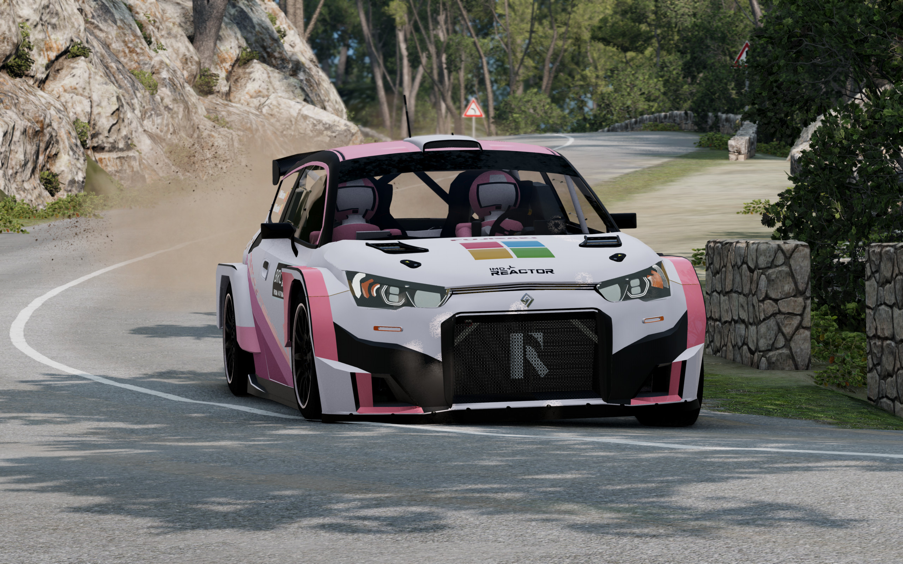
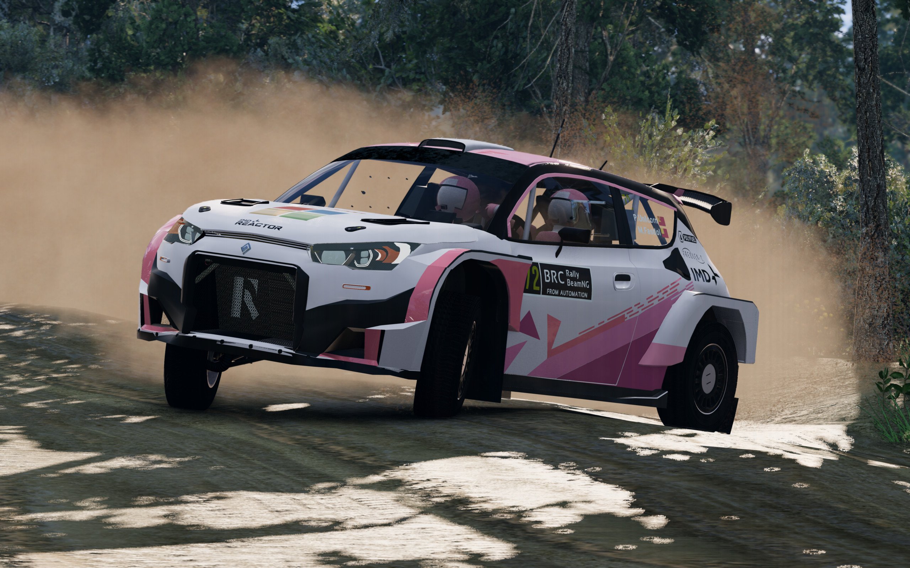
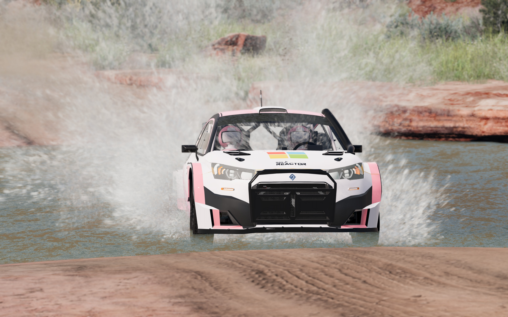
### Dimensions and Weight
- Size: 3996mm/1820mm/Height Adjustble
- Wheelbase: 2547mm/Adjustable
- Weight: 1230kg with one spare/1390kg with crew and one spare/1420kg running weight/~52:48 weight distribution
### Engine and Transmission
- Engine: H4DPA 1.6L inline 4/Rally2 ECU and modification
- Intake: 2.5 bar anti-lag turbocharger/32mm turbo restrictor
- Power: 290hp@5000RPM/438Nm@4500RPM
- Transmission: 5-speed sequential transmission/Stick shifter
- Top Speed: 187 km/h (ratio specific)
- Differential: Front and rear LSD/Locking center shaft, with hydraulic handbrake disengage mechanism
- Safari Kit: Snorkel and bullbar included following 2021 regulations
### Suspension
- Spring rates:
  
  Gravel: 18.5 to 28.5N/mm front, 15.5 to 25.5N/mm rear, incremental difference of 2.5N/mm
  
  Tarmac: 35.0 to 60.0N/mm front, 30.0 to 55.0N/mm rear, incremental difference of 5.0N/mm
  
  Safari: 16.5N/mm front, 13.0N/mm rear
  
  Helper: 3.5N/mm
- Damper Model: CTM Racing MSR80/MSR60 3+1Way
- Damper Travel: 295mm on MSR80/210mm on MSR60
- MSR80: LRS, HBS, HRS, LRS open factor adjustable, HBS damping adjustable
- MSR60: LRS, HBS, HRS, LRS open factor adjustable, HBS damping adjustable
- Shim Stacks: #1 Progressive/#2 Linear biased to progressive(gravel), digressive(tarmac)/#3 Digressive
- Adjustment Way: HS (High Speed) and LS (Low Speed) bump, rebound
- Adjustment Range: 56 levels of LS bump, 56 levels of rebound, 28 levels of HS bump and 16 levels of HBS
- Brake: 300mm gravel(selectable ducted brake)/355mm tarmac(selectable ducted brake)
### Config Specific Aerodynamics
- Front Aero: Front lip/Front fender
- Rear Aero: Rear wing/Rear bumper
- Wing Dimension: Within the frontal and top projection of the car
- Downforce level: Tarmac 120kg@180km/h, 51:49 balance/Gravel 120kg@180km/h, 47:53 balance

## Pre-17 WRC (Formerly WRC)
*A tribute to 11-16 WRC spec based on Rally2.*
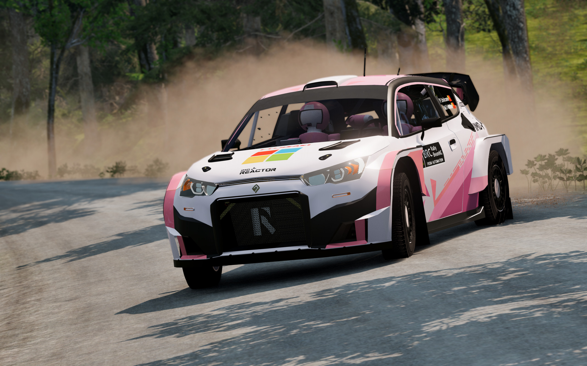
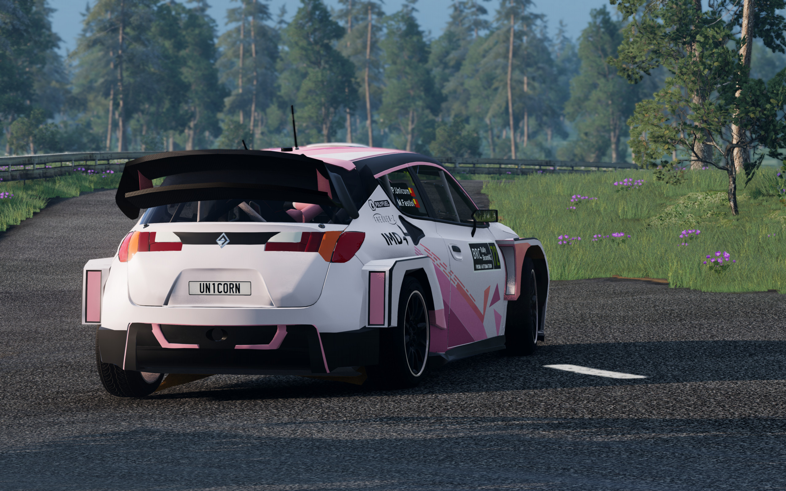
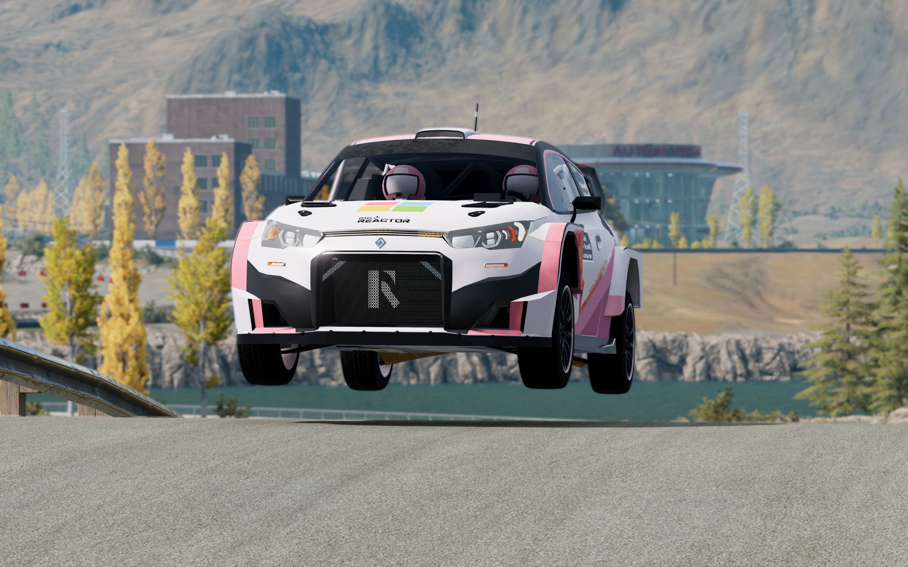
### Dimensions and Weight
- Size: 3996mm/1820mm/Height Adjustble
- Wheelbase: 2547mm/Adjustable
- Weight: 1200kg with one spare/1360kg with crew and one spare/1390kg running weight/~50:50 weight distribution
### Engine and Transmission
- Engine: H4DPA 1.6L inline 4/Pre-17 ECU and modification
- Intake: 2.5 bar anti-lag turbocharger/33mm turbo restrictor
- Power: 300hp@6000RPM/438Nm@5500RPM
- Transmission: 6-speed sequential transmission/Paddle shifter
- Top Speed: 199 km/h (ratio specific)
- Differential: Front and rear LSD/Locking center shaft, with hydraulic handbrake disengage mechanism
### Suspension
- Spring rates:
  Same as Rally2
- Damper Model: CTM Racing MSR80/MSR65 3+1Way
- Damper Travel: 295mm on MSR80/240mm on MSR65(220mm set by default)
- Damper Details: Same as found on other configs
- Brake: 300mm gravel(selectable ducted brake)/355mm tarmac(selectable ducted brake)
### Config Specific Aerodynamics
- Front Aero: Front lip/Front fender
- Rear Aero: Rear wing/Rear bumper
- Wing Dimension: Within the frontal and top projection of the car
- Downforce level: Tarmac 200kg@200m/h, 51:49 balance/Gravel 200kg@200km/h, 47:53 balance

## RX1 (Formerly RX Supercar)
*The rallycross beast based on Rally2.*
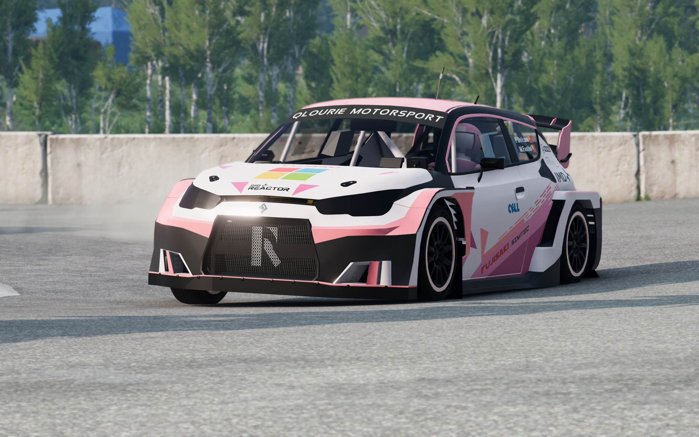
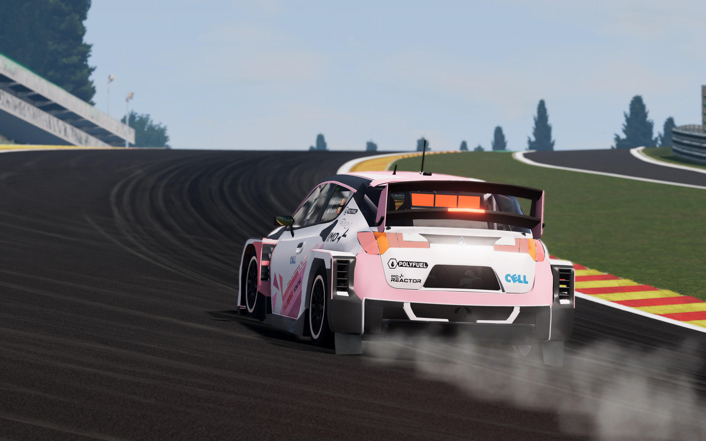
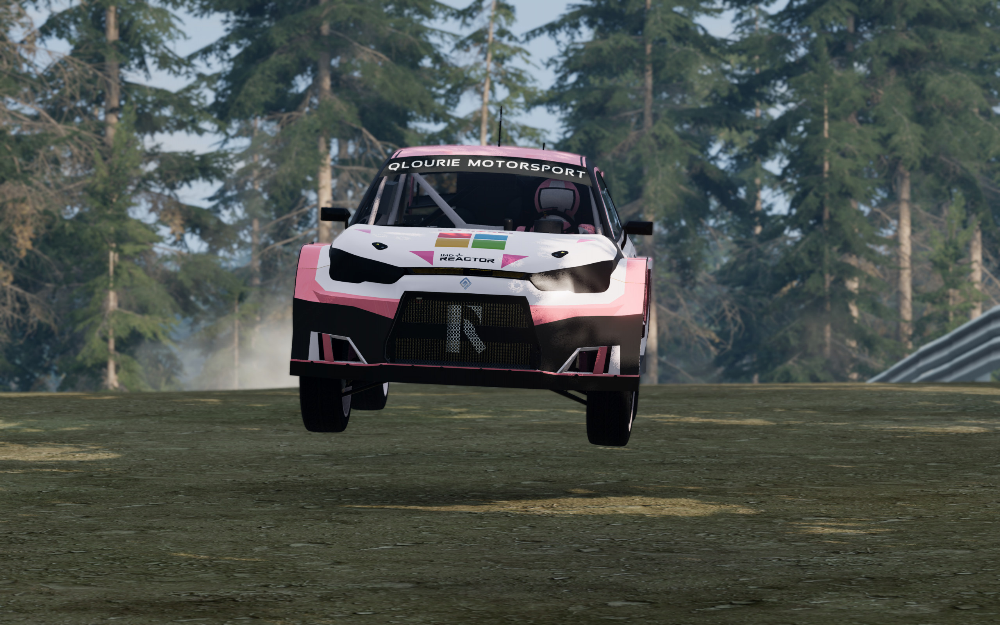
### Dimensions and Weight
- Size: 4034mm/1850mm/Height Adjustble
- Wheelbase: 2547mm/Adjustable
- Weight: 1300kg minimum running weight/~52:48 weight distribution
### Engine and Transmission
- Engine: H4DPF 2.0L inline 4/WRX ECU and modification
- Intake: 3.4 bar anti-lag turbocharger/45mm turbo restrictor
- Power: 600hp@6000RPM/820Nm@4500RPM/Over 1000hp without restrictor
- Transmission: 6-speed sequential transmission/Stick shifter
- Top Speed: 223 km/h (ratio specific)
- Differential: Front and rear LSD/Center LSD, with hydraulic handbrake disengage mechanism
### Suspension
- Spring rates:
  
  RX: 28.0 to 36.0N/mm front, 24.0 to 32.0N/mm rear, incremental difference of 4.0N/mm
  
  Helper: 4.5N/mm
- Damper Model: CTM Racing MRX80 3+1Way
- Damper Travel: 290mm on MRX80
- MRX80: LRS, HBS, HRS, LRS open factor adjustable, HBS damping adjustable
- Shim Stacks: #1 Linear biased to progressive/#2 Digressive
- Adjustment Way: HS (High Speed) and LS (Low Speed) bump, rebound
- Adjustment Range: 50 levels of LS bump, 50 levels of rebound, 40 levels of HS bump and 16 levels of HBS
- Brake: 355mm(selectable ducted brake)
### Config Specific Aerodynamics
- Front Aero: Front lip/Front fender
- Rear Aero: Rear wing/Rear diffuser
- Wing Dimension: Within the frontal and top projection of the car
- Downforce level: 200kg@220m/h, 47:53 balance

## Rally1 Prototype
*Developing in progress, tesing in progess, unlimited potential.*
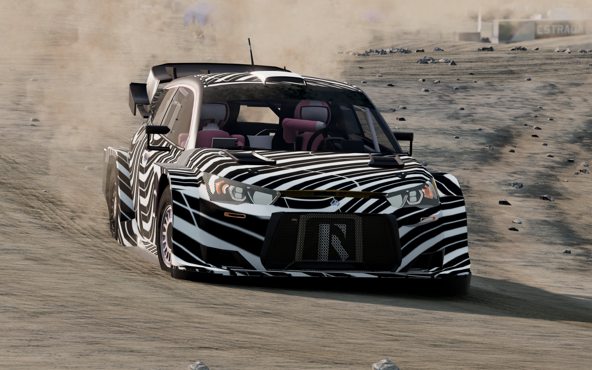
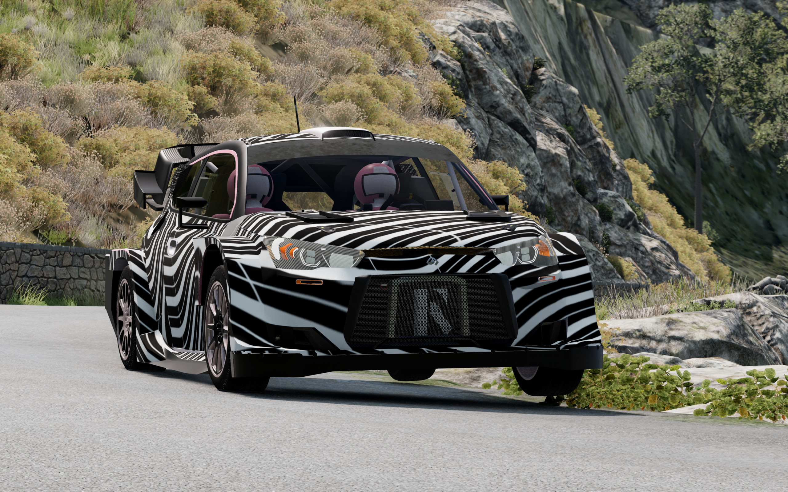
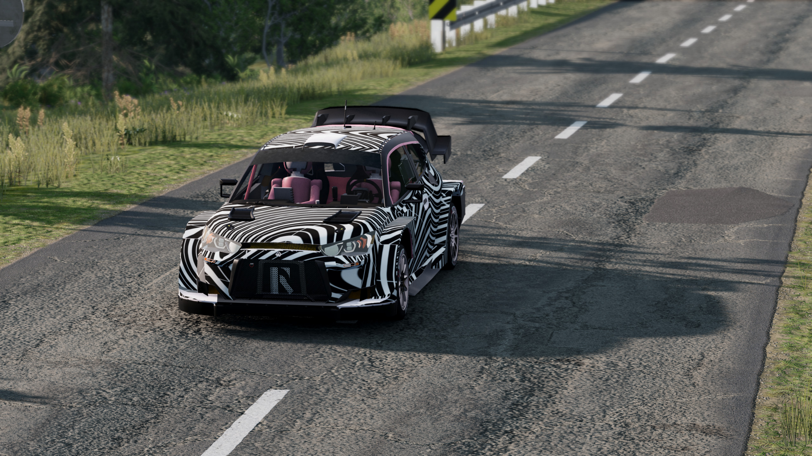
### Dimensions and Weight
- Size: 4134mm/1875mm/Height Adjustble
- Wheelbase: 2601mm/Adjustable
- Weight: 1260kg with one spare/1410kg with crew and one spare/1440kg running weight/~50:50 weight distribution
### Engine and Transmission
- Engine: H4DPA 1.6L inline 4/BRC ECU and modification **Without Hybrid**
- Intake: 2.5 bar anti-lag turbocharger/36mm turbo restrictor
- Power: 380hp@6000RPM/450Nm@5500RPM
- Transmission: 5-speed sequential transmission/Stick shifter
- Top Speed: 199 km/h (ratio specific)
- Differential: Front and rear LSD/Locking center shaft, with hydraulic handbrake disengage mechanism
### Suspension
- Spring rates:
  Same as BRC
- Damper Model: CTM Racing MSR89/MSR69 3+1Way
- Damper Travel: 270mm on MSR89/240mm on MSR69
- Damper Details: Same as found on other configs
- MSR89: LRS, DSV, HBS, HRS, LRS open factor adjustable, HBS damping adjustable
- MSR69: LRS, DSV, HBS, HRS, LRS open factor adjustable, HBS damping adjustable
- Shim Stacks: #1 Progressive/#2 #2 Linear biased to progressive(gravel), digressive(tarmac)/#3 Digressive
- Adjustment Way: HS (High Speed) and LS (Low Speed) bump, rebound
- Adjustment Range: 64 levels of LS bump, 64 levels of rebound, 32 levels of HS bump and 16 levels of HBS
- Brake: 300mm gravel(selectable ducted brake)/370mm tarmac(selectable ducted brake)
### Config Specific Aerodynamics
- Front Aero: Front splitter/Diveplane/Front fender
- Rear Aero: Rear wing/Rear bumper
- Wing Dimension: 50mm higher than frontal projection/40mm longer than rear bumper
- Downforce level: Tarmac 270kg@200m/h, 51:49 balance/Gravel 270kg@200km/h, 47:53 balance

# Existing Problems (that are mostly not going to be fixed)
- Due to insufficient chassis Jbeam noding, in rare cases you may encounter chassis vibration.
- All colors and materials are none adjustable, the color theme is fixed. (You can manually adjust in Material Editor though, but it's not RGB image so no simple way to change color)
- Due to the way Automation exports (when I exported), all decals and skins are actual models instead of decal image. This means the skin and decal will sometimes clip through car model. Also, it will take more space to load
- Also because of UV is messed, sometimes there are messed up textures due to modified mesh.
- Meshes are still Automation level so it may not be comparable to a full fledged mod
- Flexbody animations are not perfect, especially around engine and transmission, it just works but it's not accurate

 # Gallery 
