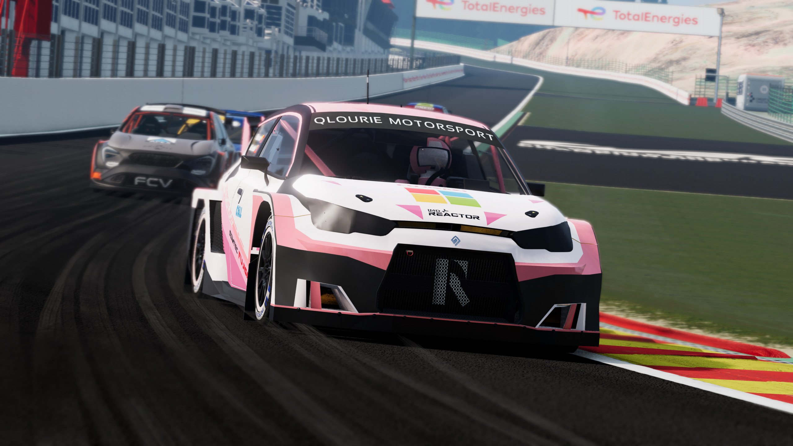
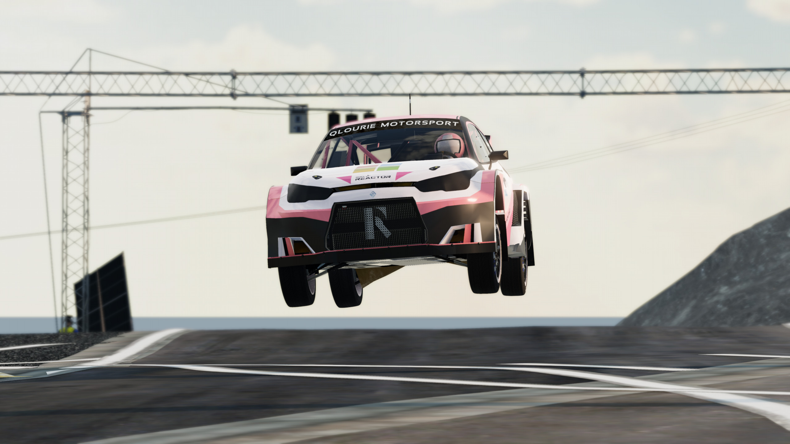
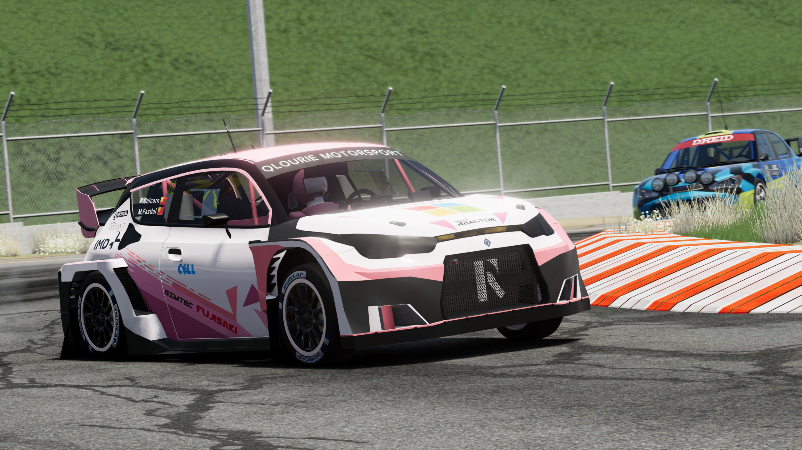
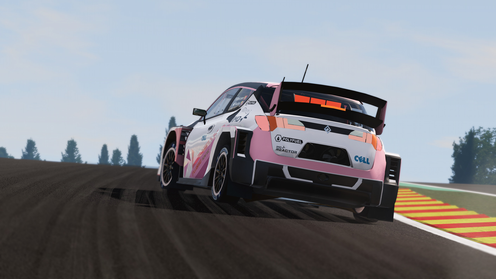
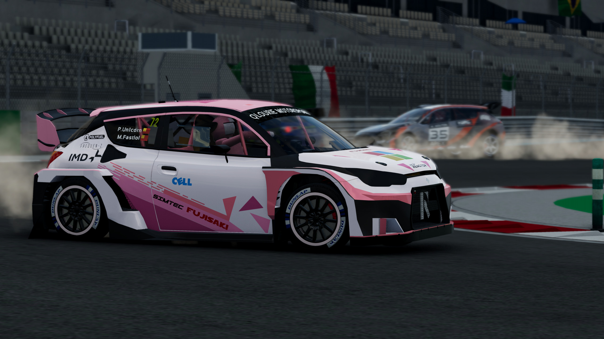
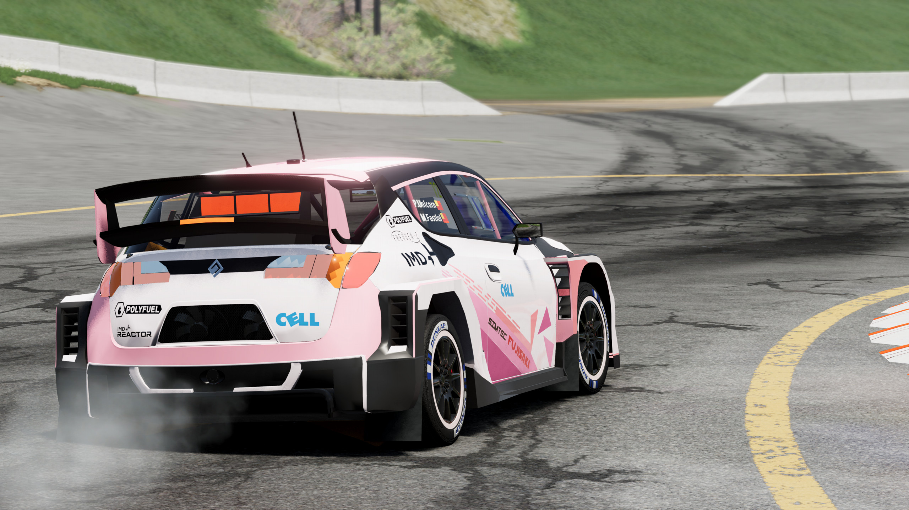
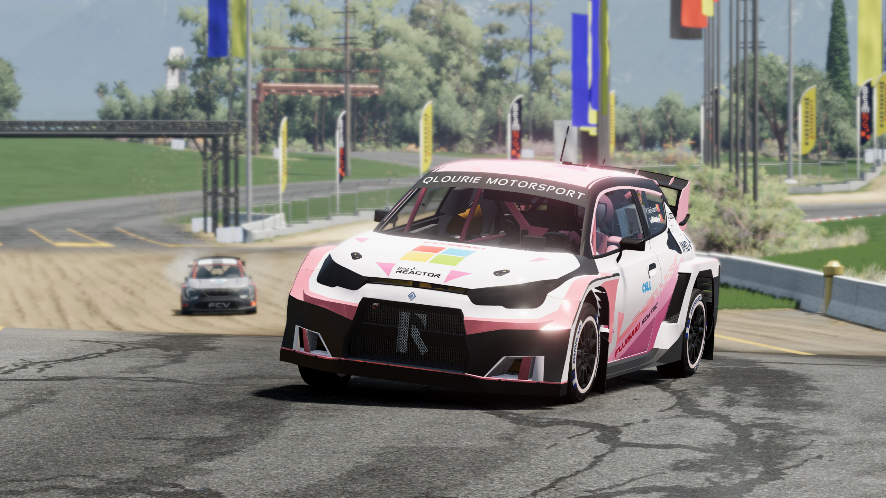
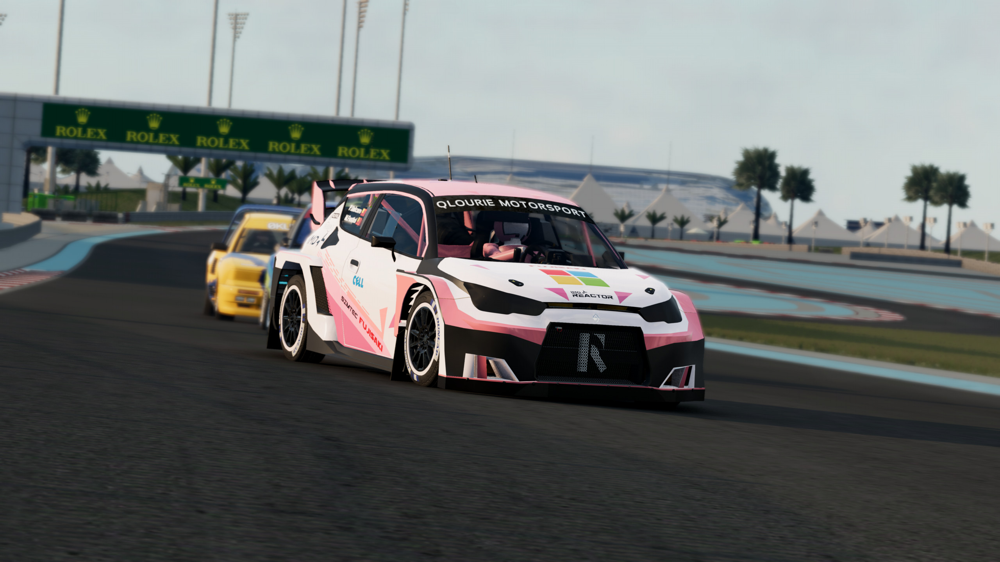
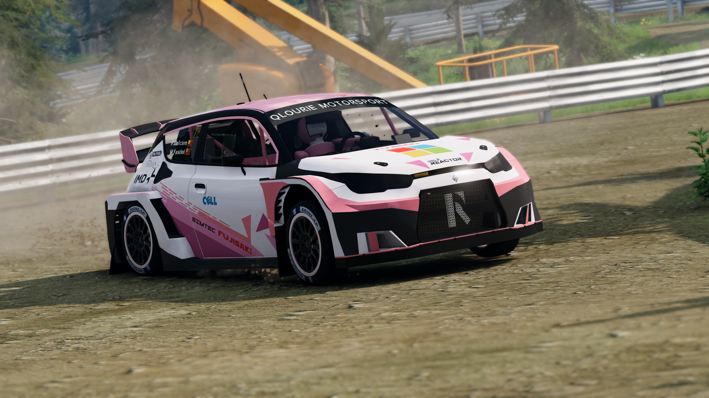
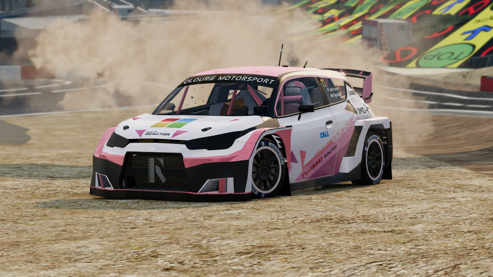

# Qlourie Astral R
My personal BeamNG mod project with some simple Lua codes.

It comes from Automation, I made the car in Automation and rewrote almost everything's Jbeam by myself so the physics are completely new. The project started at about 2022/7, and this Github repo is created at 2024/1/16.

[2022/07/24](https://www.bilibili.com/video/BV17S4y1E7BH/)
[2022/08/23](https://www.bilibili.com/video/BV1ea41157pe/)

# What Is It
This mod is inspired by the World Rally Championship (WRC). While the vanilla game features the Vivace, it doesn’t fully adhere to the actual WRC regulations concerning aspects such as weight and the center differential, suspension design and WRC aero bodykits. My goal is to craft a WRC car that complies with the 2017-2021 WRC regulations and to simulate the physics with as realistic as possible. This car will participate BRC, BeamNG Rally Championship. At the very least, the suspension system will offer a more authentic feel compared to rally cars in the game.

Also, there are Rally2 variant and WorldRX RX1 variant, since they share some similarities.

# How to Use This Repo
## What's in this repo?
This repo contains engine sound files, all Jbeam files, and Lua files. I will create engine sound with FMOD, update Jbeam files when something is refined, and start to write lua codes for active center differential, launch control and potentially new detection method for LRS.

At the time of 2024/3/21: 

LRS detection is done

Active Center Differential is done

Launch control is BeamNG's vanilla but changed brake trigger to handbrake

## How to make it your mod?
I'm not very familiar with Github, but I know Github can't store empty folders, so maybe it's not the best idea to upload everything because there are lot's of empty folders. The reason I'm using Github is tracking of Jbeam edits and Lua writing. 

However you can update yourself if there's something you want to, manually download files and the folder structure should look like this:

**Configs: BeamNG Userdata\version\mods\unpacked\un1corn_qlourie_astral_r\vehicles\qlourie_astral_r\files**

**Jbeam: BeamNG Userdata\version\mods\unpacked\un1corn_qlourie_astral_r\vehicles\qlourie_astral_r\body and engine\files**

**Lua: BeamNG Userdata\version\mods\unpacked\un1corn_qlourie_astral_r\vehicles\qlourie_astral_r\Lua\files**

**Engine Sound: BeamNG Userdata\version\mods\unpacked\un1corn_qlourie_astral_r\art\sound\blends and engine and shift\files**

Alternatively, you can download releases for pre-release test, and eventually I will upload to BeamNG's mod repo for free.

# Things to Remind
I have a main work and it's quite busy, so I can't take my time fully on this project. As experimenting and testing Jbeam properties are quite heavy work, there are some imperfections. Also, I've found it's not worth to dig deeper with Automation model as there are tons of hassle with opacity map and mesh overlap, this mod will be at where it is. I'm not planning to make the model more detailed or get whole Jbeam design revamped.

However I'm really looking forward to build a new car from the ground up. I'm learning sketching and I plan to make a new car in Blender, at that time it will have it's road counterpart also Rally4, Rally2 variant. I'm really looking forward to it.

Also some fiction brands and sponsors! There is actually now in the mod by Automation modders but I'm planning to make my own original sponsors.

# Features
## Chassis
- Modified chassis for better stability and rigidity, also slightly moved suspension mounting points
- Rollcage installed for maximum safety
- Separated parts from Automation model for better deformation and animation
## Engine and Transmission
- Realistic engine curve referenced from telemetry of simluators
- Top speed limit 201 km/h within regulation
- Turbo restrictor and ECU setting for different variant
## Suspension
- Front and rear MacPherson Strut suspension
- Reinforced front and rear subframe for stronger rigidity
- Extra long suspension arms for better FVSA length, optimized FVSA for less camber change
- Calculated suspension geometry for optimal bump steer and toe steer performance
- Front caster adjustable
- Anti-roll bar mounting point adjustable with 3 fixed stiffness ARBs
- 540 degree steering wheel lock
- 9:1 quick steering ratio on all models allowing maximum of around 30 degrees of wheel angle
## Damper and Spring
- Dampers developed with **CTM Racing Suspension**
- Around 800mm gravel damper length, 600mm tarmac damper length
- LRS (Load Release System): Release rebound damping when wheel load below a set threshold is detected, allowing even higher rebound damping setting with faster wheel contact and all power to the ground. Rebound damping is lowered according to how much force the internal detection mass have. The damping curve is returned to normal is wheel load is above threshold
- Hydraulic Bump Stop: Additional damping valve that will active at around from the last 60mm of damper travel, the valve is closed to generate a siginificant amount of damping force, up to 24KN of damping force at 2m/s. Smoother ride quality when riding on bump stop and better impact absorption. Rubber bump stop is still installed on HBS model for protection.
- Independently modelled mesh instead of Automation suspension with flexbody help node to enhances animations
- Bump velocity threshold (knee point) is moved in response to changes in fast and slow bump settings, providing a more accurate representation of real-world damper tuning
- Front and rear interchangeable design, same LS bump and rebound valving, more HS bump on front than rear
- Biased to progressive damping with increased damping during fast bump events, enhancing performance to significant impacts in rallying
- Individually tested spring length when spawning for better spring simulation
- Springs are selected as parts instead of tuning
## Misc
- 10/20KG ballast for center of gravity adjustment (10KG needed to meet minimum weight regulations)
- Driver weight included in racing seat part
- Rally light for better vision at night events (about 7kg, also act as ballast)
- Spare wheel selection for weight accuracy
- 

# BRC (Formerly WRC and now Rally1)
The pinnacle rallying class which now is anticipating BRC.

## Chassis
- Lightweight chassis
- 1190KG minimum measured with only one spare
- 1360KG minimum with driver and co-driver and one spare
- ~1390KG tarmac running weight, ~1415kg gravel running weight (Running weight includes fuel and tools like in real life)
- ~50/50 weight distribution for optimal chassis dynamics
- 4105mm long, 1875mm track width, 2535mm wheelbase

## Engine and Transmission
- 1.6L Inline4 H1598P4 with WRC ECU
- 2.5 bar anti-lag turbocharger, 36mm turbo restrictor
- Over 380HP at 6000RPM, 450Nm at 5500RPM (within the 3.1kg/hp regulation)
- 6 speed sequential transmission, paddle shifter
- Adjustable gear ratios
- Top speed 201 km/h (ratio specific)
- Front and rear adjustable mechanical LSD
- 2 homologated active center differential in response to steering and throttle input. Power bias 48/52 for gravel and 36/64 for tarmac.

## Suspension
- 300mm gravel brake disc, 370mm tarmac brake disc
- Adjustable brake bias
- Front and rear ducted brake

## Damper and Spring
- CTM Racing mono-tube MSR85 3+1Way dampers for gravel, MSR65 3+1Way dampers for tarmac
- Over 300mm of travel on gravel damper, around 220mm of travel on tarmac damper
- Hydraulic bump stop and hydraulic rebound stop equipped on both MSR85 and MSR65
- LRS implemented for faster wheel extension when no load is applied to the wheel, additionally open factor adjustable
- HS (High Speed) and LS (Low Speed) bump, rebound, hydraulic bump stop, 3+1 WAY adjustable
- 64 levels of LS bump, 64 levels of rebound, 32 levels of HS bump and 16 levels or hydraulic bump stop adjustment
- Spring rates:
  
  Gravel: 17.5 to 30.0N/mm front, 15.0 to 27.5N/mm rear, incremental difference of 2.5N/mm

  Tarmac: 35.0 to 60.0N/mm front, 30.0 to 55.0N/mm rear, incremental difference of 5.0N/mm

  Helper: 2.5N/mm
## Tyres
- 20KG per tarmac wheel and 25kg per gravel wheel
- Node weight calculated based on the rim weight limit (8.6kg and 8.9kg) as specified by WRC regulations
- 205/65 R15 gravel wheels, 235/40 R18 tarmac wheels
- Wheel beam properties are tested and modified to get best performance

## Aerodynamics
- Front and rear independent aerodynamics
- Front lip and rear diffuser react to ground clearance change
- Two layer WRC style rear wing with winglet attached, 50mm higher than frontal projection and 40mm longer than rear bumper side projection
- Rear wing endplate aerodynamics for better control when sliding
- Total about 400kg of downforce at 200km/h

# Rally2 (Formerly R5)
The most popular class around the world. 

## Chassis
- Lightweight chassis (10kg heavier than BRC)
- 1230KG minimum measured with only one spare
- 1390KG minimum with driver and co-driver and one spare wheel 
- ~1420KG tarmac running weight, ~1445kg gravel running weight (Running weight includes fuel and tools like in real life)
- ~50/50 weight distribution for optimal chassis dynamics
- 3985mm long, 1820mm track width, 2535mm wheelbase

## Engine and Transmission
- 1.6L Inline4 H1598P4 with Rally2 ECU
- 2.5 bar anti-lag turbocharger, 32mm turbo restrictor
- 290HP at 5000RPM, 438Nm at 4500RPM (within the 4.2kg/hp regulation)
- 5 speed sequential transmission, stick shifter
- Adjustable gear ratios
- Top speed 193 km/h (ratio specific)
- Front and rear adjustable mechanical LSD
- Locked transfer case with 50/50 power bias

## Suspension
- 300mm gravel brake disc, 355mm tarmac brake disc
- Adjustable brake bias
- Front ducted brake, rear not ducted

## Damper and Spring
- CTM Racing mono-tube MSR80 3Way dampers for gravel, MSR60 3Way dampers for tarmac
- Around 310mm of travel on gravel damper, around 210mm of travel on tarmac damper
- Hydraulic bump stop equipped on MSR80, hard bump stop on MSR60, hard rebound stop on both MSR80 and MSR60
- LRS implemented for faster wheel extension when no load is applied to the wheel, open factor non adjustable
- HS (High Speed) and LS (Low Speed) bump, rebound, 3WAY adjustable
- 56 levels of LS bump, 56 levels of rebound, 28 levels of HS bump adjustment
- Spring rates:
  
  Gravel: 19.0 to 29.0N/mm front, 16.0 to 26.0N/mm rear, incremental difference of 2.5N/mm

  Tarmac: 38.0 to 58.0N/mm front, 33.0 to 53.0N/mm rear, incremental difference of 5.0N/mm

  Helper: 2.5N/mm
## Tyres
- 205/65 R15 gravel wheels, 235/40 R18 tarmac wheels
- Wheel beam properties are tested and modified, a little bit less performance than BRC wheels

## Aerodynamics
- Front and rear independent aerodynamics
- Front lip react to ground clearance change
- One layer Rally2 style rear wing, within the frontal projection of the car
- Total about 150kg of downforce at 200km/h

# RX1 (Formerly RX Supercar)
The rallycross beast converted from Rally2.

## Chassis
- Rally2 chassis with weight reduction
- 1300KG minimum with driver and fuel, no matter running weight
- ~52/48 weight distribution for optimal chassis dynamics
- 4043mm long, 1850mm track width, 2535mm wheelbase

## Engine and Transmission
- 2.0L Inline4 H2000P4 with WRX modification
- 3.4 bar anti-lag turbocharger, 45mm turbo restrictor
- 600HP at 6000RPM, 820Nm at 4500RPM, without restrictor over 1000HP and 1500Nm
- 5 speed sequential transmission, stick shifter
- Adjustable gear ratios
- Top speed 210 km/h (ratio specific)
- Front and rear adjustable mechanical LSD
- Locked transfer case with 50/50 power bias

## Suspension
- 355mm brake disc
- Adjustable brake bias
- Front ducted brake, rear not ducted

## Damper and Spring
- CTM Racing mono-tube MRX75 3Way damper
- Around 300mm of travel
- Hydraulic bump stop and hard rebound stop
- LRS implemented for faster wheel extension when no load is applied to the wheel, open factor non adjustable
- HS (High Speed) and LS (Low Speed) bump, LS rebound, 3WAY adjustable
- 40 levels of LS bump, 40 levels of LS rebound, 28 levels of HS bump and 20 levels of HS rebound adjustment
- Spring rates:

  RX: 46.0N/mm, 50.0N/mm, 54.0N/mm front, 42.0N/mm, 46.0N/mm, 50.0N/mm rear
  
  Helper: 2.5N/m
## Tyres
- 225/640 R17 RX wheels
- Wheel beam properties are tested and modified, biased to sliding performance

## Aerodynamics
- Front and rear independent aerodynamics
- Front lip react to ground clearance change
- Aero geared to anti-diving when jumping instead of high speed downforce
- Two layer RX style rear wing, within the frontal projection and within the projection of the car seen from above, within the size regulations
- Total about 200kg of downforce at 200km/h

# Existing Problems (that are mostly not going to be fixed)
- Due to insufficient chassis Jbeam noding, in rare cases you may encounter chassis vibration.
- All colors and materials are none adjustable, the color theme is fixed. (You can manually adjust in Material Editor though, but it's not RGB image so no simple way to change color)
- Due to the way Automation exports (when I exported), all decals and skins are actual models instead of decal image. This means the skin and decal will sometimes clip through car model. Also, it will take more space to load
- Also because of UV is messed, sometimes there are messed up textures due to modified mesh.
- Meshes are still Automation level so it may not be comparable to a full fledged mod
- Flexbody animations are not perfect, especially around engine and transmission, it just works but it's not accurate

 # Gallery 
 

